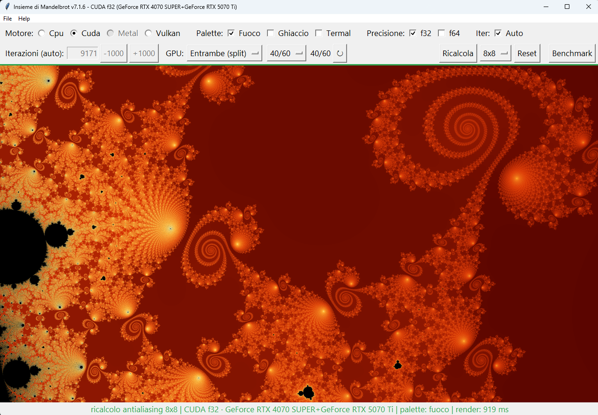
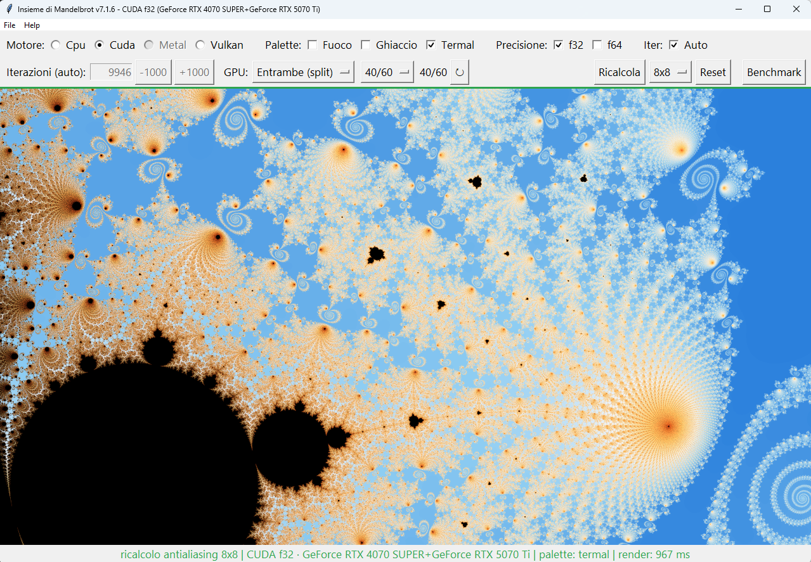
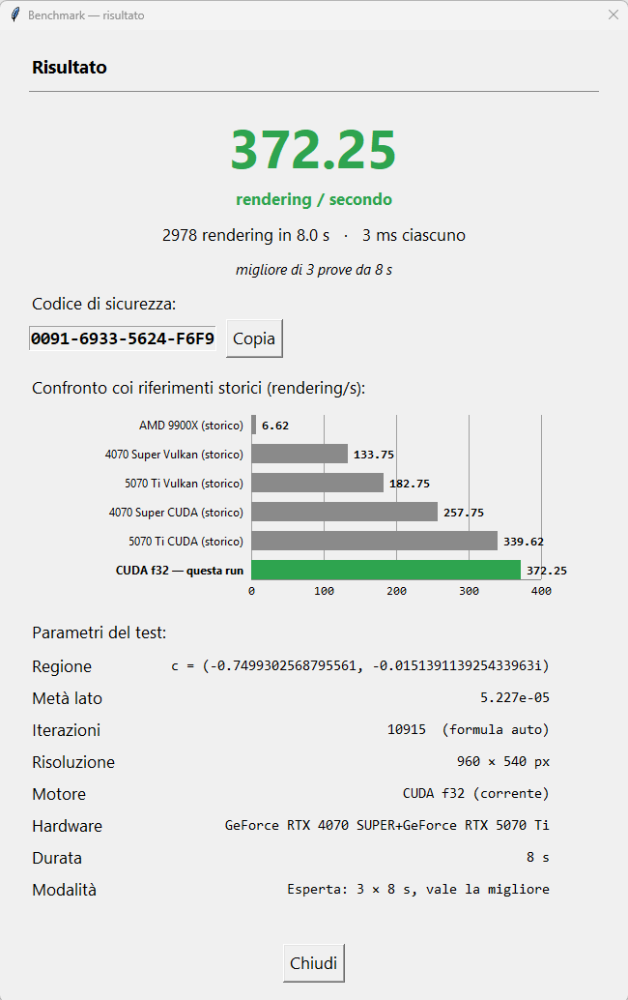
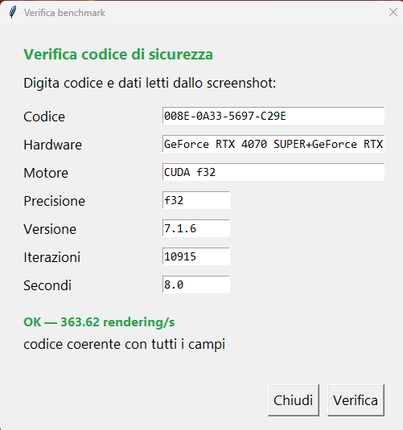

# MAB - Mandelbrot Ai benchmark per LLM agentica — v7.2.0

Questo repo è un **benchmark per testare le capacità agentiche e di
programmazione di una LLM** su un progetto software reale e vivo: un
visualizzatore interattivo dell'insieme di Mandelbrot (Python + Tkinter)
con 4 motori di rendering selezionabili a runtime (CPU, CUDA, Vulkan, Metal) e fallback automatico
sulla CPU. La LLM lavora qui come sviluppatore: implementa funzioni,
corregge bug, fa refactor e rilascia versioni — il tutto verificato
bit-identico prima di ogni commit (vedi sotto).



## Download

| Piattaforma | File |
|---|---|
| Windows 64-bit (v7.2.0) | [Mandelbrot-v7.2.0-win64.zip](https://github.com/ciskje/MAB/releases/download/v7.2.0/Mandelbrot-v7.2.0-win64.zip) |
| macOS (v7.2.0) | [Mandelbrot-v7.2.0-macos.dmg](https://github.com/ciskje/MAB/releases/download/v7.2.0/Mandelbrot-v7.2.0-macos.dmg) |

Vulkan incluso ovunque; CUDA richiede driver NVIDIA + runtime utente
(scaricabile da [NVIDIA CUDA Downloads](https://developer.nvidia.com/cuda-downloads)).
Altre versioni nella pagina [Releases](https://github.com/ciskje/MAB/releases).

> **macOS al primo avvio**: l'app è firmata ad-hoc, non notarizzata da
> Apple, quindi Gatekeeper la blocca. Trascinala in `Applicazioni`, poi
> tasto destro (Ctrl-clic) su `Mandelbrot.app` → **Apri** → **Apri**.
> In alternativa da terminale: `xattr -cr /Applications/Mandelbrot.app`.


[](LICENSE)

## Funzioni

- **Navigazione fluida**: zoom con rotella al cursore (×1.25/×0.8), click
  ×2, click destro ×0.5, trascinamento per il pan, tasti `+`/`-`/`r`.
- **4 motori**: CPU (numpy/Numba multi-core), CUDA (CuPy), Metal (Apple
  Silicon), Vulkan (wgpu, funziona out-of-the-box su AMD/NVIDIA/Intel).
  I backend non disponibili restano visibili ma disabilitati.
- **Multi-GPU**: dropdown GPU per device CUDA e adapter Vulkan; su 2 CUDA
  c'è lo split "Entrambe" in bande orizzontali con rapporto calibrabile.
- **Precisione** f32/f64 (f64 dove il backend la supporta), **palette**
  fuoco/ghiaccio/termal, **iterazioni** auto (logaritmiche sullo zoom) o
  manuali.
- **Ricalcolo antialiasing** 1x1/2x2/4x4/8x8, salvataggio PNG (`Ctrl+S`) e
  zone JSON (vista + iterazioni, ricaricabili).
- **Benchmark standardizzato** (8 s; su GPU a 4x area con rps normalizzato
  ×4, CPU 1x) ed **Esperto** (3×8 s, vale la migliore) con grafico dei
  riferimenti storici e **codice di autenticità a 64 bit** anti-ritocco,
  verificabile in `Help > Verifica benchmark...`.

## Requisiti

- Python 3.14, `numpy`, `Pillow` (sempre); `numba` consigliato (altrimenti
  fallback numpy single-core).
- GPU: CUDA richiede driver NVIDIA + runtime (rilevati via
  cuda-pathfinder); Vulkan è incluso nel pacchetto; Metal solo su macOS.

## Avvio

```bash
python mandel.py
```

## Build dell'app

Solo su richiesta esplicita (mai automatica):

```bash
python build_app.py
```

Produce l'app self-contained (Windows: EXE + zip in `dist/`; macOS: .app
firmata ad-hoc + .dmg). Dettagli in `spec.md` §11.

## Benchmark per LLM

Il progetto è sviluppato anche e soprattutto con una AI locale (Qwen3.8
27B). `spec.md` (specifica tecnica sempre in sync col sorgente) e
`AGENTS.md` (convenzioni di lavoro: versionamento, build, note operative)
sono tenuti aggiornati proprio per questo: dati in pasto a una LLM,
permettono di testarne le capacità agentiche e di programmazione su un
progetto reale (refactor, bugfix verificati, bump di versione disciplinati).

## Schermate







## Struttura

| file | ruolo |
|---|---|
| `mandelbrot/` | il programma (`config`, `palette`, `state`, `mem`, `cpu`, `cuda`, `metal`, `vulkan`, `engine`, `app`, `expert`) |
| `mandel.py` | entry-point + compatibilità `import mandel` |
| `spec.md` | specifica tecnica (sempre in sync col sorgente) |
| `build_app.py` / `mandelbrot.spec` / `hook_dlldir.py` | build PyInstaller |
| `make_icon.py` | genera l'icona dell'app dal motore CPU |
